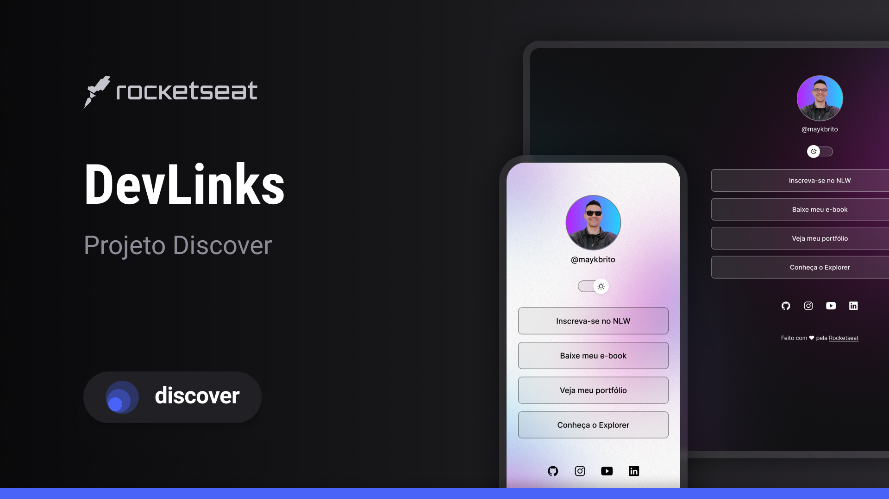

# Projeto DevLinks
- Este projeto foi desenvolvido na [Trilha Discover da Rocketseat](https://www.rocketseat.com.br/discover)
- O DevLinks é um agregador de links para usar como cartão de visitas online.
- [Acesse o meu projeto finalizado](https://hsoaresbianca.github.io/devlinks/)

## Tecnologias Utilizadas
- HTML e CSS
- JavaScript
- Git e Github
- Figma
  
## Layout
Você pode visualizar o layout do projeto através [DESSE LINK](https://www.figma.com/community/file/1187422022288947321). É necessário ter conta no [Figma](https://figma.com) para acessá-lo.

## Licença
Esse projeto está sob a licença MIT.

---
<h1 align="center"> DevLinks </h1>

Programa exclusivo e gratuito, promovido pela Rocketseat para ensino de tecnologias WEB.  
<a href="https://www.rocketseat.com.br/discover">Estude esse projeto em formato de vídeo clicando aqui.</a>

  

 

  

---

  Feito com ♥ by Rocketseat :wave: <a href="https://discord.gg/rocketseat">Participe da nossa comunidade!</a>

